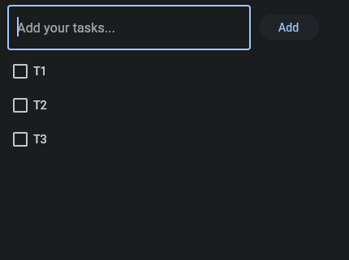

# Instalacion y Hello World

En funcion de tu sistema operativo realizar la instalacion de Flet y crear la primera app Hello-Flet

Referencia:

[Creating Flet apps in Python](https://flet.dev/docs/guides/python/getting-started)

## Windows Instalacion

Crear virtual enviroment e instalar Flet

Create a new virtual environment:
Navigate to the directory where you want to create your project and run the following command:

```sh
pipenv shell
```

Install Flet:
With the virtual environment activated, you can now install your project dependencies using pip

```sh
pipenv install flet
```

## Ubuntu Instalacion

Crear virtual enviroment e instalar Flet

Create a new virtual environment:
Navigate to the directory where you want to create your project and run the following command:

```sh
mkvirtualenv flet
```

Install Flet:
With the virtual environment activated, you can now install your project dependencies using pip

```sh
pip install flet
```

## First apps

### Basic flet app structure

```python
import flet as ft

def main(page: ft.Page):
    # add/update controls on Page
    pass

ft.app(target=main)

```

to run on webbrowser

```python
ft.app(target=main, view=ft.AppView.WEB_BROWSER)
```

### Hello Flet

[Hello Flet app](./Leccion1-Hello-Flet-app.py)

```python
import flet as ft

def main(page: ft.Page):
    t = ft.Text(value="Hello, world!", color="green")
    page.controls.append(t)
    page.update()

ft.app(target=main, view=ft.AppView.WEB_BROWSER)

```


### Add text in a loop

[Add-text-in-loop.py](./Leccion1-Add-text-in-loop.py)

```python
import flet as ft
import time

def main(page):
  t = ft.Text()
  page.add(t)

  for i in range(10):
    t.value = f'Step {i}'
    page.update()
    time.sleep(1)

ft.app(target=main, view=ft.AppView.WEB_BROWSER)

```

### Add multiple texts in a container

[Text-Container](./Leccion1-Text-Container.py)

```python
import flet as ft

def main(page):
  page.add(
    ft.Row(controls=[
      ft.Text('Text 1'),
      ft.Text('Text 2'),
      ft.Text('Text 3'),
    ])
  )

ft.app(target=main, view=ft.AppView.WEB_BROWSER)
```

### Basic Button

[Basic-Button](./Leccion1-Basic-Button.py)

```python
import flet as ft

def main(page):
  def button_clicked(e):
    page.add(ft.Text('Clicked'))

  page.add(ft.ElevatedButton(text= 'Click me!', 
                             on_click=button_clicked))
  
ft.app(target=main, view=ft.AppView.WEB_BROWSER)

```

### Add text and Checkbox with button (Basic Todo)

[Todo](./Leccion1-Todo.py)

```python
import flet as ft 

def  main (page):
  def add_clicked(e):
    page.add(ft.Checkbox(label=new_task.value))
    new_task.value = ''
    new_task.focus()
    new_task.update()

  new_task = ft.TextField(hint_text='Add your tasks...',width=300)
  page.add(ft.Row([new_task,ft.ElevatedButton('Add',on_click=add_clicked)]))
  
ft.app(target=main, view=ft.AppView.WEB_BROWSER)

```


